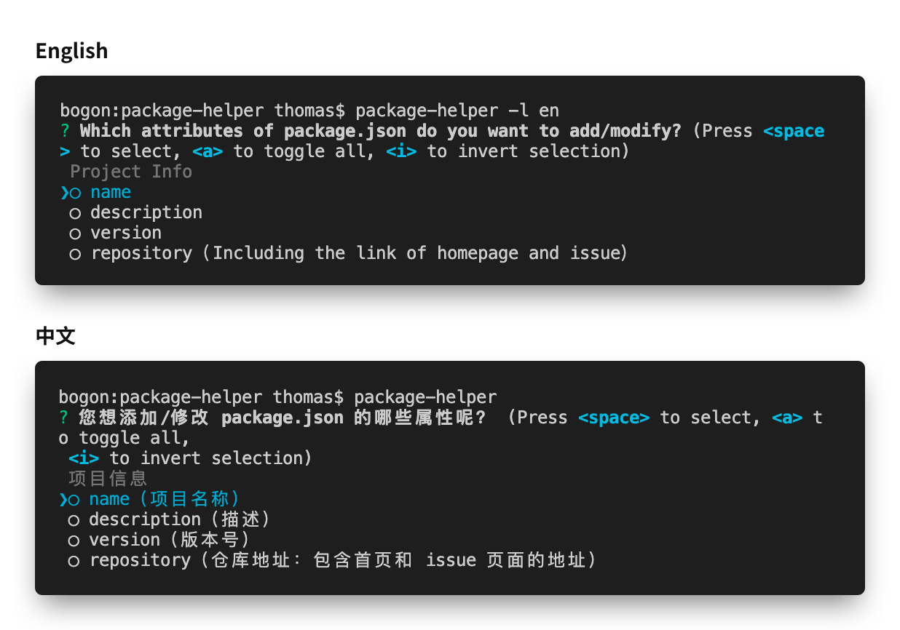

# Package Helper

> Other languages / 其他语言:  
> [English](./README.md) | [简体中文](./README.zh_CN.md)  

A tool helps you to edit the package.json by interactive command line.

## Features

- Interactive command line
- Internationalization support for Chinese, English.
- Can be used as a NodeJS module.



## Usage

### Install

```bash
npm i -g @qiqi1996/package-helper
```

### Command Line

```bash
package-helper
# Will read/parse/modify the package.json of current working directory.
package-helper /path/to/package.json
# Specified the path of package.json"
```

```bash
package-helper -h
# See the useage information.

Usage: package-helper [options] <filepath:./package.json>

A tool helps you to edit the package.json by interactive command line.

Options:
  -l, --language <en|zh-CN>  specified the language of the output. For 
                             default situation, it will use your system 
                             language.
  -v, --version              output the current version
  -h, --help                 output usage information
```

### As Module

```javascript
const helper = require("@qiqi1996/package-helper");

(async()=>{
    let source = {};
    // You can read `package.json` content to `source`, and all the input from users will merge to it.

    let list = [ "name", "description" ];
    // Guide user to input these attributes of the package.json
    // if `list` is a empty array, `package-helper` will ask user which attributes of the package.json does they want to add or modify.

    helper.locale("zh-CN");
    // Set the output language. For default situation, it will use your system language.
    // Chinese - zh-CN
    // English - en

    let result = await helper.guide(list, source);
    // `list` and `source` are both optional.
    // `result` is the data that input by users before merge to `source`.
    // NOTICE: source will be modified

    let json = helper.format(source)
    // Get the formated json string
})()
```

## License

MIT

Copyright 2019(c), qiqi1996.com. All right reserved.